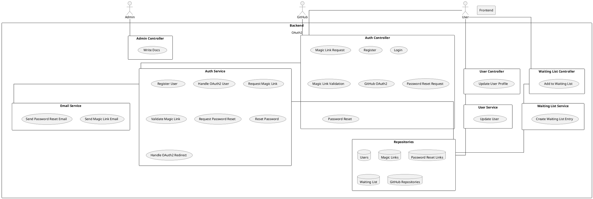

# StreamRepo Backend README

## Overview

This project implements the backend for StreamRepo, a platform for managing and analyzing code repositories.  The backend is built using Spring Boot, MongoDB, and utilizes JWT for authentication.  It provides functionalities for user registration, authentication (including OAuth 2.0 with GitHub), password management (including magic link and password reset), user profile updates, and managing a waiting list.  Additionally, it includes basic admin functionality and a WebSocket configuration.  The backend interacts with the GitHub API to validate user-provided links and potentially perform further analysis (though this functionality is not fully implemented in the provided code).

## System Architecture

## Setup

1. **Clone the repository:** `git clone <repository_url>`
2. **Navigate to the project directory:** `cd <project_directory>`
3. **Install dependencies:**  Use Maven or your preferred build tool to download the project dependencies.  (e.g., `mvn clean install`)
4. **Configure Cloudinary:**  Create a Cloudinary account and set the `cloudName`, `apiKey`, and `apiSecret` in the `application.properties` file.  This is used for image storage (though this functionality is not fully implemented in the provided code).
5. **Configure Email:** Configure the email settings in `application.properties` (e.g., `spring.mail.username`, `spring.mail.password`, etc.).
6. **Configure Frontend URL:** Set the `frontend.url` property in `application.properties` to point to your frontend application.
7. **Run the application:** Use Maven or your preferred build tool to run the application. (e.g., `mvn spring-boot:run`)

## Usage

The backend exposes several REST endpoints for various functionalities.  See the "Endpoints" section below for details.  Authentication is handled using JWT.  OAuth 2.0 with GitHub is also supported.

## Endpoints

| Summary          | Path                     | Method | Authentication | Request Body              | Response Body           |
|-----------------|--------------------------|--------|-----------------|--------------------------|-------------------------|
| writeDocs        | `/api/admin/write-docs`  | POST    | ADMIN             | None                      | String                    |
| register         | `/api/auth/register`     | POST    | None              | `UserDTO`                | `ResponseDetails`        |
| login            | `/api/auth/login`       | POST    | None              | `UserDTO`                | `LoginResponse`          |
| requestMagicLink | `/api/auth/magic-link`   | POST    | None              | `MagicLinkRequest`       | `ResponseDetails`        |
| validateMagicLink| `/api/auth/validate-magic-link` | GET     | None              | `link` (query parameter) | `ResponseDetails`        |
| oauth2Github     | `/api/auth/oauth2/github`| GET     | None              | None                      | Redirect to frontend    |
| requestPasswordReset | `/api/auth/forgot-password` | POST    | None              | `MagicLinkRequest`       | `ResponseDetails`        |
| resetPassword    | `/api/auth/reset-password`| POST    | None              | `PasswordResetRequest`   | `ResponseDetails`        |
| updateUser       | `/api/user/update`       | PUT     | JWT               | `UserDTO`                | `ResponseDetails`        |
| createWaitingList| `/waiting-list/user`    | POST    | None              | `WaitingListDTO`         | `ResponseDetails`        |

**Note:**  `ResponseDetails` contains a timestamp, message, status code, and path. `LoginResponse` includes the JWT token and `ResponseDetails`.  ADMIN authentication requires an admin role token. JWT authentication requires a valid JWT token in the Authorization header (`Bearer <token>`).

## Testing

Unit and integration tests are included in the `src/test/java` directory.  You can run them using your preferred testing framework (e.g., JUnit 5).

## Future Improvements

* Implement full GitHub repository analysis functionality.
* Add more robust error handling and logging.
* Implement more comprehensive security measures.
* Improve API documentation.
* Implement pagination for large datasets.

## Contributing

Contributions are welcome! Please open an issue or submit a pull request.

## Contact

For any questions or issues, please contact okoroaforkelechi123@gmail.com.
